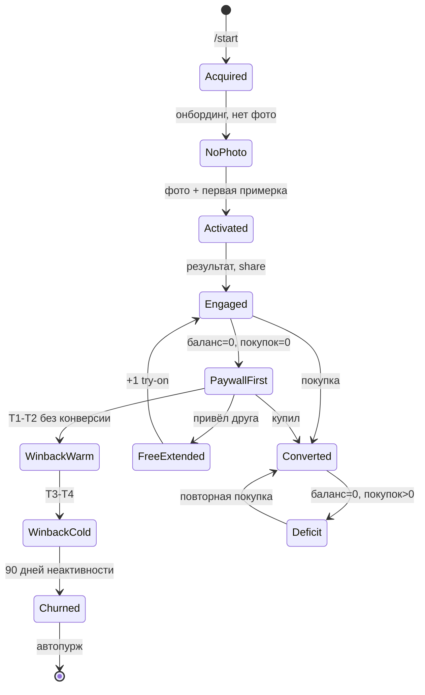
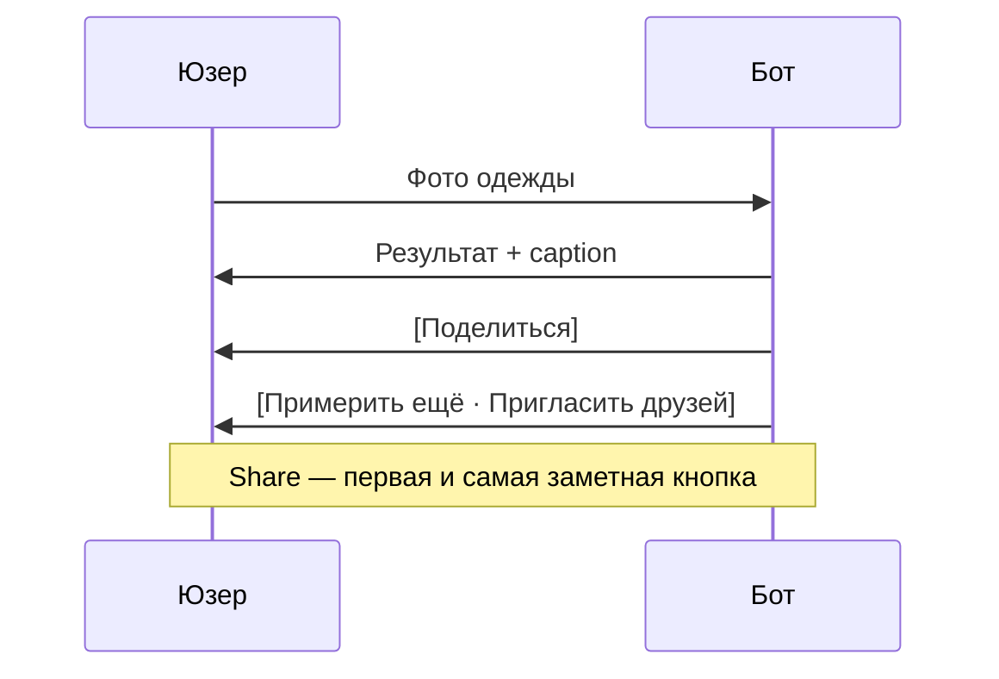
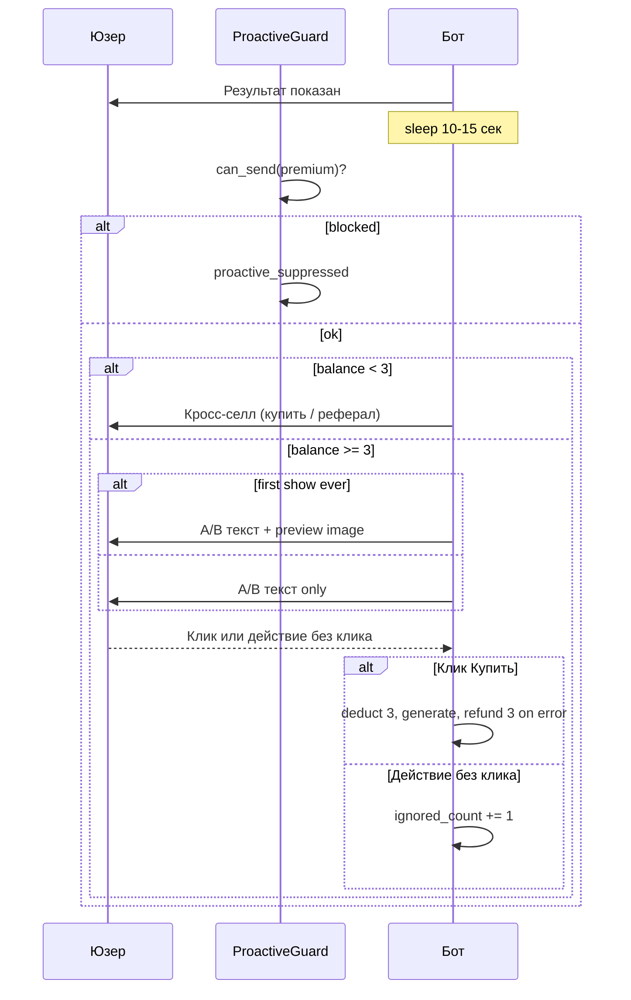
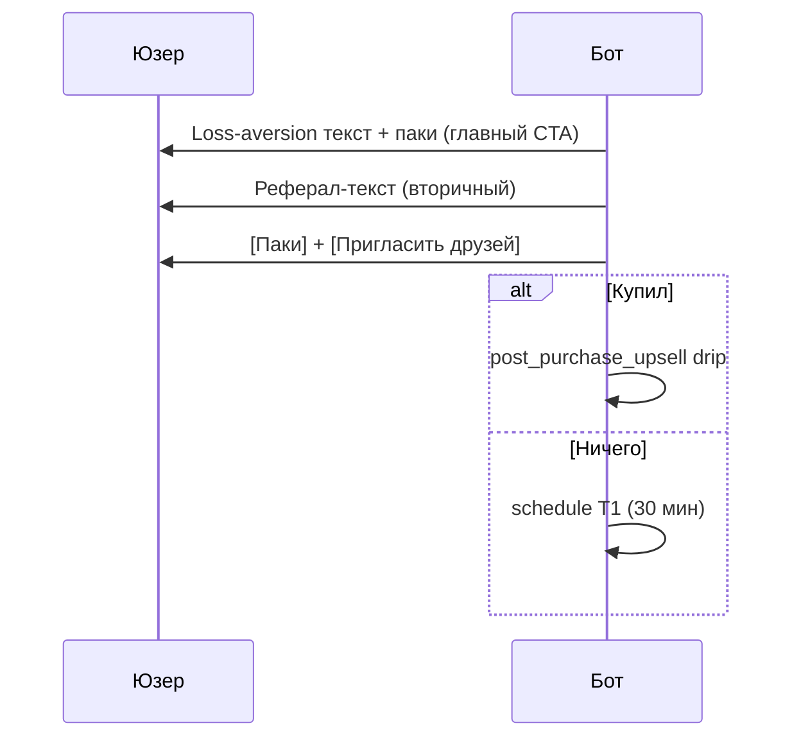
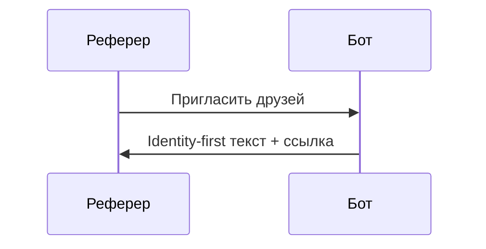
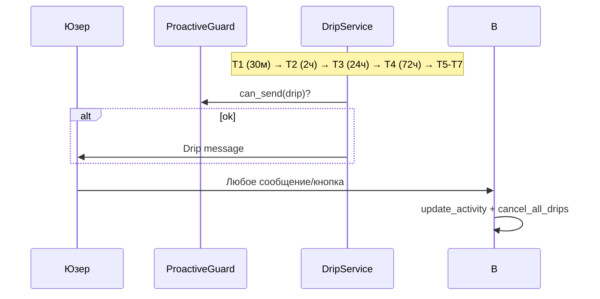

# Монетизационная воронка v2 — design spec

**Дата:** 2026-07-16  
**Статус:** Approved — design review complete, pending implementation plan  
**Локаль:** RU в приоритете (Моя примерка), EN-версия (FitRoom) — зеркальная локализация по тем же принципам  
**Зависит от:** Try-on V1, Style Guide Upsell v1 (`2026-07-15-style-guide-upsell-design.md`), система рефералов, Payments/Stars  
**Заменяет:** цену 1 try-on за стиль-гайд из Style Guide Upsell v1 — v2 **полностью** переводит SKU на 3 try-on'а с первого дня релиза (без fallback на 1)

---

## Approved decisions (brainstorm 2026-07-16)

| Решение | Выбор |
|---|---|
| Премиум-стайлинг | Полная замена: всегда 3 try-on'а, UI/списание/refund; кнопка 1 try-on убирается |
| A/B оффера | **P0**: `hash(telegram_id) → variant 1/2`, события `premium_offer_shown_v1/v2`, `premium_offer_purchased_v1/v2` |
| Подписка на канал | **Отложено** — релиз когда у владельца будет канал |
| Пейвол (без канала) | Покупка — главный CTA; «Пригласить друзей» — единственный бесплатный путь, вторым и менее заметным |
| Фатиг премиум-оффера | +1 при первом действии юзера после показа оффера без клика «Купить» (один раз на показ) |
| Анти-коллизии | Полный P0.3: `ProactiveGuard` + activity middleware (`last_active_at` + `drip.cancel_all` на каждое событие) |
| Клавиатура результата | §8.1: share самый заметный; премиум **только** через delayed-оффер 10–15 с, не на клавиатуре результата |
| Архитектура guard | Центральный `bot/services/proactive_guard.py` (рекомендованный подход 1) |

---

## 0. Контекст

Бот pre-launch (0 реальных пользователей). Уже работает: рефералка (+1 рефереру за первую примерку друга, лимит 10/мес), Stars-пакеты, стиль-гайд за 1 try-on (будет заменён).

**В scope v2 (Фаза 1):**

1. **Премиум-стайлинг** — репрайсинг до 3 try-on'ов, A/B-оффер в момент пика, превью при первом показе.
2. **Пейвол/дефицит v2** — loss-aversion + реферал как бесплатный путь на первом пейволе.
3. **Анти-коллизии и усталость** — единый `ProactiveGuard` для всех проактивных асков.
4. **Реферальный копирайт v2** — идентичность вместо транзакции.
5. **Дрип** — отмена всей очереди при любой активности; T1.5 (канал) не входит в релиз.

**Отложено (см. §15):** подписка на канал, drip T1.5, `channel_sub_rewarded_at`.

---

## 1. Problem Statement

Сейчас при 0 кредитов у пользователя единственный путь — купить (`build_result_message` в `tryon.py`: только `shop_keyboard`/`deficit_keyboard`). Часть аудитории уходит, не приведя друга. Стиль-гайд даёт больше ценности (8–10 образов, палитра, аксессуары — см. `build_style_guide_prompt`), чем стоит (1 try-on), и не коммуницирует объём до покупки. Проактивные сообщения (дрип, style guide offer) не проверяют активность юзера — оффер может всплыть во время генерации. `update_user_activity()` есть в DB, но нигде не вызывается.

---

## 2. Goals

- **G1 — бесплатное продление (v2 без канала).** На первом пейволе доступен реферал как бесплатный путь. Метрика: доля юзеров на первом пейволе, нажавших «Пригласить друзей» или получивших реферальную конверсию — гипотеза ≥15% в первый месяц. *После релиза канала G1 расширится до «канал ИЛИ реферал», таргет ≥25%.*
- **G2 — честный премиум.** CTR премиум-оффера (3 try-on) ≥ CTR текущего `style_guide_offer` (1 try-on) за первые 2 недели.
- **G3 — ноль коллизий.** 0 подтверждённых показов проактивного сообщения во время активной генерации (`analytics_events` + `proactive_suppressed`).
- **G4 — защита от усталости.** 100% соответствие cooldown/fatigue-лимитам (§11), проверяется тестами.
- **G5 — A/B с первого дня (P0).** Вариант закрепляется один раз; конверсия по вариантам трекается отдельно.

---

## 3. Non-Goals

- Партнёрская/CPA-программа с товарными ссылками в борде (P2.1).
- Пересборка цен обычных паков.
- Персонализация премиума через уточняющий вопрос (P2.2).
- Более двух A/B-вариантов на одну фичу.
- Подписка на канал в этом релизе (отдельный тикет после появления канала).

---

## 4. Психологические принципы

- **Peak-end rule** — премиум-оффер и share близко к моменту результата.
- **Лестница асков** — share (ноль усилий) → реферал → покупка → премиум 3 try-on.
- **Loss aversion** — пейвол: «ты уже получил X — не теряй момент».
- **Идентичность** — реферал: «покажи как выглядишь», бонус вторым планом.
- **Zeigarnik** — A/B вариант 2: «ты видел только 1 из 9 способов».
- **Decoy/anchoring** — премиум 3 try-on поднимает воспринимаемую ценность паков.
- **Усталость/бэкофф** — фатиг-лимиты обязательны (G4).

---

## 5. Архитектура

### 5.1 `ProactiveGuard` (`bot/services/proactive_guard.py`)

Единая точка проверки перед любой проактивной отправкой (премиум-оффер, дрип).

```python
async def can_send(self, telegram_id: int, touchpoint: str) -> bool:
    # 1. generation_locks — блок для всех touchpoints
    # 2. last_active_at — премиум: < 2 мин; дрип: < 10 мин
    # 3. touchpoint-specific: cooldown, fatigue, paused_until, style_guide_path
```

При `False`: `analytics.track(telegram_id, "proactive_suppressed", touchpoint)`; отправка **отменяется** (не переносится).

### 5.2 Activity middleware

На каждое `message` / `callback_query`:

1. `db.update_user_activity(telegram_id)`
2. `drip.cancel_all(telegram_id)`
3. Если есть незакрытый премиум-оффер без клика — `premium_offer_ignored_count += 1` (см. P0.4)

Регистрируется в `main.py` до роутеров.

### 5.3 Приоритет touchpoints

Реактивные аски (премиум-оффер, привязанный к результату) выигрывают у фоновых (дрип). Если оба готовы в одном окне — дрип подавляется на этом цикле, не reschedule.

---

## 6. Карта состояний



*`FreeExtended` через канал — после релиза §15.*

---

## 7. Требования

### P0

**P0.1 — Премиум-стайлинг (3 try-on, полная замена).**

- Given успешный try-on, when `ProactiveGuard` разрешает, then через 10–15 с показывается A/B-оффер за 3 try-on'а.
- Given первый показ оффера за всё время, then текст + превью `assets/guide/premium_preview.jpg`.
- Given баланс < 3, then мягкий кросс-селл: докупи или позови друга (без канала).
- Given ошибка генерации после оплаты, then refund **3** try-on'ов.
- Given `style_guide_path` уже есть для генерации, then оффер не показывается.
- Given `result_keyboard`, then **нет** кнопки стиль-гайда; порядок: share (первая строка) → примерить ещё · пригласить.
- Промпт генерации **без изменений** (уже 8–10 образов в `build_style_guide_prompt`).

**P0.2 — A/B (входит в P0, не P1).**

- `premium_offer_variant = hash(telegram_id) % 2 + 1` при первом показе, сохраняется в БД.
- События: `premium_offer_shown_v1`, `premium_offer_shown_v2`, `premium_offer_purchased_v1`, `premium_offer_purchased_v2`.
- Тексты — §10, варианты 1 и 2.

**P0.3 — Анти-коллизии.**

- Before send: `generation_locks` ИЛИ `last_active_at` < 2 мин (премиум) / < 10 мин (дрип) → отмена.
- On any message/callback: `update_user_activity` + `drip.cancel_all`.

**P0.4 — Фатиг премиум-оффера.**

- После показа оффера для `generation_id` бот ждёт: клик «Купить» **или** первое квалифицирующее действие юзера (сообщение, callback, новая примерка).
- Если действие без клика — `ignored_count += 1` **один раз на этот показ** (повторные сообщения до следующего результата не считаются).
- При `ignored_count >= 3` → `premium_offer_paused_until` = now + 14 дней.
- Клик «Купить» сбрасывает `ignored_count`.
- После истечения паузы счётчик сбрасывается при следующем показе.
- Трекинг: in-memory или поле `premium_offer_pending_generation_id` до закрытия окна оффера.

**P0.5 — Cooldown премиум-оффера.**

- Повторный показ подавляется, если `premium_offer_last_shown_at` < 4 ч назад.

**P0.6 — Пейвол/дефицит v2.**

- Первый пейвол: loss-aversion текст + `shop_keyboard` + кнопка «Пригласить друзей» (вторичная).
- Дефицит: только апсейл, без бесплатных путей.

**P0.7 — Реферальный текст v2.**

- Identity-first копирайт (§10) в `invite_text` и на пейволе.

### P1

- **P1.1** Низкий баланс (1–3 try-on): текст с упоминанием реферала; упоминание канала — после §15.
- **P1.2** Win-back перед автопуржем (~85-й день) с реальной скидкой.

### P2

- Аффилиат-ссылки, персонализация премиума, перепроверка подписки на канал.

---

## 8. Sequence diagrams

### 8.1 Результат try-on



### 8.2 Премиум-оффер



### 8.3 Пейвол



### 8.4 Реферал v2



### 8.5 Дрип + activity cancel



---

## 9. БД — новые поля

| Таблица | Поле | Тип | Назначение |
|---|---|---|---|
| `users` | `premium_offer_variant` | INTEGER NULL | A/B вариант 1 или 2 |
| `users` | `premium_offer_shown_once` | INTEGER DEFAULT 0 | Управляет preview-картинкой |
| `users` | `premium_offer_ignored_count` | INTEGER DEFAULT 0 | Счётчик игноров |
| `users` | `premium_offer_paused_until` | TEXT NULL | Пауза после 3 игноров |
| `users` | `premium_offer_last_shown_at` | TEXT NULL | Cooldown 4 ч |

`channel_sub_rewarded_at` — **не добавляем** в этом релизе.

Существующие: `generation_locks`, `generations.style_guide_path`, `drip_jobs`, `last_active_at`.

---

## 10. Тексты (RU; EN — зеркально)

### Пейвол v2
> Ты уже примерил 2 образа — и один реально огонь 🔥  
> Продолжи: 5 примерок за 50⭐  
>  
> Не готов платить? Покажи другу, как ты выглядишь — +1 бесплатная, когда он примерит ✨

Клавиатура: паки + `Пригласить друзей`.

### Дефицит v2
> Опять кончились? Похоже, тебе заходит 😏  
> В этот раз — Популярная: 15 примерок за 120⭐ (дешевле за примерку, чем в прошлый раз)

### Реферал v2
> Покажи другу, как ты выглядишь в этом образе — пусть попробует сам ✨  
> (а когда он сделает первую примерку — тебе +1 бесплатная)

### Премиум — Вариант 1 (рацио)
> 9 образов за 3 примерки — дешевле за образ, чем обычная примерка. Твоя палитра + обувь, сумка и аксессуары к этой вещи.  
Кнопка: `✨ Полный стайлинг — 3`

### Премиум — Вариант 2 (идентичность)
> Хочешь, чтобы спросили "у тебя что, стилист?" 👀  
> 9 образов с этой вещью, точная палитра, подбор аксессуаров — весь набор профи-стайлинга.  
Кнопка: `✨ Полный стайлинг — 3`

### Премиум — preview caption (первый показ)
> Вот что получаешь — твоя версия будет с этим образом

### Премиум — кросс-селл (баланс < 3)
> Для полного стайлинга нужно 3 примерки, у тебя {balance}. Докупи или позови друга — и попробуй 👇

### Премиум — ошибка
> Не получилось собрать стайлинг — вернул(а) все 3 примерки. Попробуем ещё раз?

### Низкий баланс (P1.1)
> ⚠️ Осталось {count} примерок. Успей пригласить друга — +1 бесплатная 👇

---

## 11. Anti-collision & timing

| Touchpoint | Триггер | Подавление | Cooldown | Fatigue |
|---|---|---|---|---|
| Share | Сразу на результате | — | — | — |
| Премиум-оффер | 10–15 с после результата | lock ИЛИ activity < 2 мин | 4 ч | 3 игнора → 14 дней |
| Пейвол/дефицит | balance = 0 | — | — | — |
| Дрип T1 | 30 мин после 1-й примерки | lock ИЛИ activity < 10 мин | — | cancel on activity |
| Дрип T2–T4 | 2ч / 24ч / 72ч | activity < 10 мин | — | cancel on activity |
| Дрип T5–T7 | после T4 | activity < 10 мин | — | cancel on activity |

---

## 12. Метрики

**Leading:** activation rate, paywall referral CTR, premium CTR по вариантам A/B, `proactive_suppressed` rate, fatigue pause rate.

**Lagging:** 30d retention (referral vs organic), repeat purchase rate, ARPU, autopurge rate.

Гипотезы — пересмотр после 2–4 недель данных.

---

## 13. Тесты

- `ProactiveGuard`: locks, activity windows, cooldown, fatigue, pause
- Premium: 3-credit deduct/refund, stable A/B assignment, first-show preview
- Paywall: shop + invite, no style guide on result keyboard
- Activity middleware: `last_active_at` updated, drips cancelled
- Ignore counter: increments on action without premium click

---

## 14. Фазы реализации

**Фаза 1 (P0):** `ProactiveGuard`, activity middleware, премиум 3 try-on + A/B, пейвол/дефицит/реферал v2, result keyboard §8.1, drip cancel on activity.

**Фаза 2 (P1):** low-balance notification, win-back перед пуржем.

**Фаза 3 (P2):** аффилиат, персонализация, перепроверка канала.

---

## 15. Deferred — подписка на канал

Релиз отдельным тикетом, когда у владельца будет Telegram-канал.

**Будет включать:**

- `channel_sub_rewarded_at`, `CHANNEL_ID` в config (per locale)
- Handler: ссылка → «Я подписался» → `getChatMember` → +1 try-on разово
- Кнопка на пейволе и в кросс-селле при balance < 3
- Drip T1.5 (1 ч после T1): мягкий оффер канала
- G1 расширится: «канал ИЛИ реферал», таргет ≥25%
- Копирайт из оригинального черновика §10 (канал-оффер, успех, уже получено, не подтверждено)
- P1 low-balance: добавить упоминание канала

**Prerequisite:** бот — admin канала с правом `getChatMember`; контент-план канала.

---

## 16. Open questions

- Ценовая сетка RU (YooKassa) для премиума — владелец продукта.
- Порог значимости A/B при низком трафике — аналитика, не блокирует P0.
- Юридическая проверка аффилиат-формулировок (P2) — не блокирует релиз.
